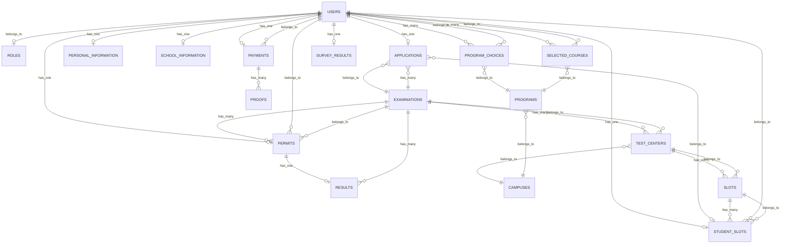

# TPT Database Entity Relationship Diagram (ERD)

**Version 1.0 | February 2026**

---

## Table of Contents

1. [Overview](#1-overview)
2. [Entity Relationship Diagram](#2-entity-relationship-diagram)
3. [Table Definitions](#3-table-definitions)
4. [Relationships](#4-relationships)
5. [Database Schema Details](#5-database-schema-details)

---

## 1. Overview

The TPT Examination System uses a MySQL relational database with the following core entity groups:

| Entity Group | Tables | Purpose |
|--------------|--------|---------|
| **User Management** | users, roles | User accounts and roles |
| **Application** | applications, personal_information, school_information, program_choices | Student application data |
| **Payment** | payments, proofs | Payment verification |
| **Examination** | examinations, permits, results | Exam management |
| **Test Centers** | campuses, test_centers, slots, student_slots | Venue & scheduling |
| **Programs** | programs, selected_courses | Course offerings |
| **Survey** | survey_results | Post-exam feedback |

---

## 2. Entity Relationship Diagram

### High-Level ERD (Mermaid Diagram)



### Visual ERD (Text-Based)

```
┌─────────────────────────────────────────────────────────────────────────────┐
│                           USER MANAGEMENT                                   │
├─────────────────────────────────────────────────────────────────────────────┤
│                                                                             │
│  ┌─────────────┐         ┌─────────────────────┐                           │
│  │   roles     │         │       users         │                           │
│  ├─────────────┤         ├─────────────────────┤                           │
│  │ PK id       │◀────────│ FK role_id          │                           │
│  │    name     │         │ PK id               │                           │
│  └─────────────┘         │    email            │                           │
│                          │    password         │                           │
│                          │    first_name       │                           │
│                          │    middle_name      │                           │
│                          │    last_name        │                           │
│                          │    step             │                           │
│                          │    remarks          │                           │
│                          └──────────┬──────────┘                           │
│                                     │                                       │
└─────────────────────────────────────┼───────────────────────────────────────┘
                                      │
        ┌─────────────────────────────┼─────────────────────────────┐
        │                             │                             │
        ▼                             ▼                             ▼
┌───────────────────┐    ┌───────────────────┐    ┌───────────────────┐
│personal_information│    │school_information │    │  program_choices  │
├───────────────────┤    ├───────────────────┤    ├───────────────────┤
│ PK id             │    │ PK id             │    │ PK id             │
│ FK user_id        │    │ FK user_id        │    │ FK user_id        │
│    applicant_type │    │    school_name    │    │ FK program_id     │
│    present_address│    │    school_address │    │    priority       │
│    permanent_addr │    │    level          │    └───────────────────┘
│    phone_number   │    │    gwa            │              │
│    date_of_birth  │    │    strand         │              ▼
│    place_of_birth │    │    school_type    │    ┌───────────────────┐
│    age            │    │    year_graduated │    │     programs      │
│    sex            │    └───────────────────┘    ├───────────────────┤
│    tribe          │                             │ PK id             │
│    religion       │                             │ FK campus_id      │
│    nationality    │                             │    name           │
│    citizenship    │                             │    is_offered     │
│    photo          │                             └───────────────────┘
└───────────────────┘                                       │
                                                            ▼
                                                  ┌───────────────────┐
                                                  │     campuses      │
                                                  ├───────────────────┤
                                                  │ PK id             │
                                                  │    name           │
                                                  │    address        │
                                                  └───────────────────┘


┌─────────────────────────────────────────────────────────────────────────────┐
│                           APPLICATION & PAYMENT                             │
├─────────────────────────────────────────────────────────────────────────────┤
│                                                                             │
│  ┌─────────────────┐         ┌─────────────────┐         ┌───────────────┐ │
│  │     users       │         │   applications  │         │  examinations │ │
│  ├─────────────────┤         ├─────────────────┤         ├───────────────┤ │
│  │ PK id           │◀────────│ FK user_id      │         │ PK id         │ │
│  └─────────────────┘         │ PK id           │────────▶│    title      │ │
│          │                   │ FK examination_id│         │    school_year│ │
│          │                   │ FK student_slot_id         │    date_start │ │
│          │                   │    status       │         │    date_end   │ │
│          │                   │    submitted_at │         │    is_active  │ │
│          │                   └─────────────────┘         │    show_results│
│          │                                               └───────────────┘ │
│          │                                                                 │
│          ▼                                                                 │
│  ┌─────────────────┐         ┌─────────────────┐                          │
│  │    payments     │         │     proofs      │                          │
│  ├─────────────────┤         ├─────────────────┤                          │
│  │ PK id           │◀────────│ FK payment_id   │                          │
│  │ FK user_id      │         │ PK id           │                          │
│  │    reference_no │         │    file_path    │                          │
│  │    status       │         │    original_name│                          │
│  │    remarks      │         └─────────────────┘                          │
│  └─────────────────┘                                                       │
│                                                                             │
└─────────────────────────────────────────────────────────────────────────────┘


┌─────────────────────────────────────────────────────────────────────────────┐
│                         EXAMINATION & PERMITS                               │
├─────────────────────────────────────────────────────────────────────────────┤
│                                                                             │
│  ┌─────────────────┐         ┌─────────────────┐         ┌───────────────┐ │
│  │     users       │         │     permits     │         │    results    │ │
│  ├─────────────────┤         ├─────────────────┤         ├───────────────┤ │
│  │ PK id           │◀────────│ FK user_id      │         │ PK id         │ │
│  └─────────────────┘         │ PK id           │         │FK examination_id│
│                              │ FK examination_id│────────▶│  examinee_no  │ │
│                              │    examinee_no  │◀────────│    full_name  │ │
│                              │    examinee_no_ │         │    math_raw   │ │
│                              │      updated    │         │    math_std   │ │
│                              └─────────────────┘         │    english_raw│ │
│                                                          │    english_std│ │
│                                                          │    filipino_* │ │
│                                                          │    science_*  │ │
│                                                          │    social_*   │ │
│                                                          │    total_raw  │ │
│                                                          │    total_std  │ │
│                                                          └───────────────┘ │
│                                                                             │
└─────────────────────────────────────────────────────────────────────────────┘


┌─────────────────────────────────────────────────────────────────────────────┐
│                          TEST CENTERS & SLOTS                               │
├─────────────────────────────────────────────────────────────────────────────┤
│                                                                             │
│  ┌─────────────────┐    ┌─────────────────┐    ┌─────────────────┐         │
│  │   examinations  │    │   test_centers  │    │     campuses    │         │
│  ├─────────────────┤    ├─────────────────┤    ├─────────────────┤         │
│  │ PK id           │◀───│ FK examination_id    │ PK id           │         │
│  └─────────────────┘    │ PK id           │───▶│    name         │         │
│                         │ FK campus_id    │    └─────────────────┘         │
│                         │    name         │                                │
│                         └────────┬────────┘                                │
│                                  │                                         │
│                                  ▼                                         │
│                         ┌─────────────────┐                                │
│                         │      slots      │                                │
│                         ├─────────────────┤                                │
│                         │ PK id           │                                │
│                         │ FK test_center_id│                               │
│                         │    date_of_exam │                                │
│                         │    building_name│                                │
│                         │    slots        │                                │
│                         │    number_of_rooms                               │
│                         │    is_active    │                                │
│                         └────────┬────────┘                                │
│                                  │                                         │
│                                  ▼                                         │
│  ┌─────────────────┐    ┌─────────────────┐                                │
│  │      users      │    │  student_slots  │                                │
│  ├─────────────────┤    ├─────────────────┤                                │
│  │ PK id           │◀───│ FK user_id      │                                │
│  └─────────────────┘    │ PK id           │                                │
│                         │ FK slot_id      │                                │
│                         │    time         │                                │
│                         │    room_number  │                                │
│                         │    seat_number  │                                │
│                         └─────────────────┘                                │
│                                                                             │
└─────────────────────────────────────────────────────────────────────────────┘
```

---

## 3. Table Definitions

### Core Tables

#### users
Primary user account table.

| Column | Type | Constraints | Description |
|--------|------|-------------|-------------|
| id | BIGINT | PK, AUTO_INCREMENT | Primary key |
| role_id | BIGINT | FK → roles.id | User role (1=Admin, 2=Applicant) |
| type_id | BIGINT | FK → types.id, NULL | User type |
| email | VARCHAR(255) | UNIQUE | Email address (Google OAuth) |
| password | VARCHAR(255) | NULL | Password (optional for OAuth) |
| first_name | VARCHAR(255) | NULL | First name |
| middle_name | VARCHAR(255) | NULL | Middle name |
| last_name | VARCHAR(255) | NULL | Last name |
| step | VARCHAR(10) | DEFAULT '1' | Application progress step (1-5) |
| remarks | TEXT | NULL | Admin remarks |
| profile_photo_path | VARCHAR(2048) | NULL | Profile photo |
| created_at | TIMESTAMP | | Creation timestamp |
| updated_at | TIMESTAMP | | Last update timestamp |

#### roles
User role definitions.

| Column | Type | Constraints | Description |
|--------|------|-------------|-------------|
| id | BIGINT | PK, AUTO_INCREMENT | Primary key |
| name | VARCHAR(255) | | Role name |
| created_at | TIMESTAMP | | Creation timestamp |
| updated_at | TIMESTAMP | | Last update timestamp |

**Default Roles:**
- 1: Admin
- 2: Applicant

---

### Application Tables

#### applications
Links users to examinations.

| Column | Type | Constraints | Description |
|--------|------|-------------|-------------|
| id | BIGINT | PK, AUTO_INCREMENT | Primary key |
| user_id | BIGINT | FK → users.id | Applicant |
| examination_id | BIGINT | FK → examinations.id | Target examination |
| student_slot_id | BIGINT | FK → student_slots.id, NULL | Assigned slot |
| status | VARCHAR(50) | DEFAULT 'filling_up' | Application status |
| submitted_at | VARCHAR(255) | NULL | Submission timestamp |
| created_at | TIMESTAMP | | Creation timestamp |
| updated_at | TIMESTAMP | | Last update timestamp |

#### personal_information
Applicant personal details.

| Column | Type | Constraints | Description |
|--------|------|-------------|-------------|
| id | BIGINT | PK, AUTO_INCREMENT | Primary key |
| user_id | BIGINT | FK → users.id | Owner |
| applicant_type | VARCHAR(50) | NULL | Freshmen/Transferee |
| present_address | TEXT | NULL | Current address |
| permanent_address | TEXT | NULL | Permanent address |
| phone_number | VARCHAR(20) | NULL | Contact number |
| date_of_birth | DATE | NULL | Birth date |
| place_of_birth | VARCHAR(255) | NULL | Birth place |
| age | INT | NULL | Age |
| sex | VARCHAR(10) | NULL | Male/Female |
| tribe | VARCHAR(100) | NULL | Tribe/ethnicity |
| religion | VARCHAR(100) | NULL | Religion |
| nationality | VARCHAR(100) | NULL | Nationality |
| citizenship | VARCHAR(100) | NULL | Citizenship |
| photo | VARCHAR(255) | NULL | 2x2 photo path |
| created_at | TIMESTAMP | | Creation timestamp |
| updated_at | TIMESTAMP | | Last update timestamp |

#### school_information
Applicant educational background.

| Column | Type | Constraints | Description |
|--------|------|-------------|-------------|
| id | BIGINT | PK, AUTO_INCREMENT | Primary key |
| user_id | BIGINT | FK → users.id | Owner |
| school_name | VARCHAR(255) | NULL | Previous school name |
| school_address | TEXT | NULL | School address |
| level | VARCHAR(50) | NULL | Education level |
| gwa | DECIMAL(5,2) | NULL | General Weighted Average |
| strand | VARCHAR(100) | NULL | SHS strand |
| school_type | VARCHAR(50) | NULL | Public/Private |
| year_graduated | YEAR | NULL | Graduation year |
| created_at | TIMESTAMP | | Creation timestamp |
| updated_at | TIMESTAMP | | Last update timestamp |

#### program_choices
Applicant program preferences (1st, 2nd, 3rd choice).

| Column | Type | Constraints | Description |
|--------|------|-------------|-------------|
| id | BIGINT | PK, AUTO_INCREMENT | Primary key |
| user_id | BIGINT | FK → users.id | Owner |
| program_id | BIGINT | FK → programs.id | Selected program |
| priority | INT | | Choice priority (1, 2, 3) |
| created_at | TIMESTAMP | | Creation timestamp |
| updated_at | TIMESTAMP | | Last update timestamp |

---

### Payment Tables

#### payments
Payment submission records.

| Column | Type | Constraints | Description |
|--------|------|-------------|-------------|
| id | BIGINT | PK, AUTO_INCREMENT | Primary key |
| user_id | BIGINT | FK → users.id | Payer |
| reference_number | VARCHAR(255) | NULL | Payment reference |
| status | VARCHAR(50) | DEFAULT 'pending' | pending/approved/rejected |
| remarks | TEXT | NULL | Admin remarks |
| created_at | TIMESTAMP | | Creation timestamp |
| updated_at | TIMESTAMP | | Last update timestamp |

#### proofs
Payment proof documents.

| Column | Type | Constraints | Description |
|--------|------|-------------|-------------|
| id | BIGINT | PK, AUTO_INCREMENT | Primary key |
| payment_id | BIGINT | FK → payments.id | Parent payment |
| file_path | VARCHAR(255) | | Uploaded file path |
| original_name | VARCHAR(255) | NULL | Original filename |
| created_at | TIMESTAMP | | Creation timestamp |
| updated_at | TIMESTAMP | | Last update timestamp |

---

### Examination Tables

#### examinations
Examination periods/events.

| Column | Type | Constraints | Description |
|--------|------|-------------|-------------|
| id | BIGINT | PK, AUTO_INCREMENT | Primary key |
| title | VARCHAR(255) | | Examination title |
| school_year | VARCHAR(20) | | School year (e.g., 2026-2027) |
| date_start | DATE | | Registration start date |
| date_end | DATE | | Registration end date |
| is_active | TINYINT(1) | DEFAULT 0 | Active examination flag |
| show_results | TINYINT(1) | DEFAULT 0 | Results visibility flag |
| created_at | TIMESTAMP | | Creation timestamp |
| updated_at | TIMESTAMP | | Last update timestamp |

#### permits
Examination permits issued after payment approval.

| Column | Type | Constraints | Description |
|--------|------|-------------|-------------|
| id | BIGINT | PK, AUTO_INCREMENT | Primary key |
| user_id | BIGINT | FK → users.id | Permit holder |
| examination_id | BIGINT | FK → examinations.id | Target examination |
| examinee_number | VARCHAR(50) | UNIQUE | System-generated examinee number |
| examinee_number_updated | VARCHAR(50) | NULL | Updated examinee number (for results) |
| created_at | TIMESTAMP | | Creation timestamp |
| updated_at | TIMESTAMP | | Last update timestamp |

#### results
Examination results/scores.

| Column | Type | Constraints | Description |
|--------|------|-------------|-------------|
| id | BIGINT | PK, AUTO_INCREMENT | Primary key |
| examination_id | BIGINT | FK → examinations.id | Source examination |
| examinee_number | VARCHAR(50) | | Links to permits |
| full_name | VARCHAR(255) | NULL | Student full name |
| math_raw_score | VARCHAR(10) | NULL | Math raw score |
| math_standard_score | VARCHAR(10) | NULL | Math stanine score |
| english_raw_score | VARCHAR(10) | NULL | English raw score |
| english_standard_score | VARCHAR(10) | NULL | English stanine score |
| filipino_raw_score | VARCHAR(10) | NULL | Filipino raw score |
| filipino_standard_score | VARCHAR(10) | NULL | Filipino stanine score |
| science_raw_score | VARCHAR(10) | NULL | Science raw score |
| science_standard_score | VARCHAR(10) | NULL | Science stanine score |
| social_studies_raw_score | VARCHAR(10) | NULL | Social Studies raw |
| social_studies_standard_score | VARCHAR(10) | NULL | Social Studies stanine |
| total_raw_score | VARCHAR(10) | NULL | Total raw score |
| total_standard_score | VARCHAR(10) | NULL | Total stanine score |
| created_at | TIMESTAMP | | Creation timestamp |
| updated_at | TIMESTAMP | | Last update timestamp |

---

### Test Center & Slot Tables

#### campuses
Campus/location definitions.

| Column | Type | Constraints | Description |
|--------|------|-------------|-------------|
| id | BIGINT | PK, AUTO_INCREMENT | Primary key |
| name | VARCHAR(255) | | Campus name |
| address | TEXT | NULL | Campus address |
| created_at | TIMESTAMP | | Creation timestamp |
| updated_at | TIMESTAMP | | Last update timestamp |

#### test_centers
Testing venues per examination.

| Column | Type | Constraints | Description |
|--------|------|-------------|-------------|
| id | BIGINT | PK, AUTO_INCREMENT | Primary key |
| examination_id | BIGINT | FK → examinations.id | Parent examination |
| campus_id | BIGINT | FK → campuses.id | Location campus |
| name | VARCHAR(255) | | Test center name |
| created_at | TIMESTAMP | | Creation timestamp |
| updated_at | TIMESTAMP | | Last update timestamp |

#### slots
Available examination time slots.

| Column | Type | Constraints | Description |
|--------|------|-------------|-------------|
| id | BIGINT | PK, AUTO_INCREMENT | Primary key |
| test_center_id | BIGINT | FK → test_centers.id | Parent test center |
| date_of_exam | VARCHAR(50) | | Examination date |
| building_name | VARCHAR(255) | | Building location |
| slots | INT | | Total capacity |
| number_of_rooms | INT | | Number of rooms |
| is_active | TINYINT(1) | DEFAULT 0 | Slot availability flag |
| created_at | TIMESTAMP | | Creation timestamp |
| updated_at | TIMESTAMP | | Last update timestamp |

#### student_slots
Student slot assignments.

| Column | Type | Constraints | Description |
|--------|------|-------------|-------------|
| id | BIGINT | PK, AUTO_INCREMENT | Primary key |
| user_id | BIGINT | FK → users.id | Assigned student |
| slot_id | BIGINT | FK → slots.id | Selected slot |
| time | VARCHAR(50) | | Time slot (AM/PM) |
| room_number | INT | | Assigned room |
| seat_number | INT | DEFAULT 0 | Assigned seat |
| created_at | TIMESTAMP | | Creation timestamp |
| updated_at | TIMESTAMP | | Last update timestamp |

---

### Program Tables

#### programs
Available academic programs.

| Column | Type | Constraints | Description |
|--------|------|-------------|-------------|
| id | BIGINT | PK, AUTO_INCREMENT | Primary key |
| campus_id | BIGINT | FK → campuses.id | Offering campus |
| name | VARCHAR(255) | | Program name |
| is_offered | TINYINT(1) | DEFAULT 1 | Availability flag |
| created_at | TIMESTAMP | | Creation timestamp |
| updated_at | TIMESTAMP | | Last update timestamp |

#### selected_courses
Post-exam course preferences.

| Column | Type | Constraints | Description |
|--------|------|-------------|-------------|
| id | BIGINT | PK, AUTO_INCREMENT | Primary key |
| user_id | BIGINT | FK → users.id | Student |
| program_id | BIGINT | FK → programs.id | Selected program |
| priority | INT | NULL | Preference order |
| created_at | TIMESTAMP | | Creation timestamp |
| updated_at | TIMESTAMP | | Last update timestamp |

---

### Survey Tables

#### survey_results
Post-examination survey responses.

| Column | Type | Constraints | Description |
|--------|------|-------------|-------------|
| id | BIGINT | PK, AUTO_INCREMENT | Primary key |
| user_id | BIGINT | FK → users.id | Respondent |
| responses | JSON/TEXT | NULL | Survey answers |
| created_at | TIMESTAMP | | Creation timestamp |
| updated_at | TIMESTAMP | | Last update timestamp |

---

## 4. Relationships

### One-to-One Relationships

| Parent | Child | Foreign Key | Description |
|--------|-------|-------------|-------------|
| users | personal_information | user_id | User personal details |
| users | school_information | user_id | User school background |
| users | applications | user_id | User application |
| users | payments | user_id | User payment record |
| users | permits | user_id | User exam permit |
| users | student_slots | user_id | User slot assignment |
| users | survey_results | user_id | User survey response |
| permits | results | examinee_number | Permit exam results |

### One-to-Many Relationships

| Parent | Child | Foreign Key | Description |
|--------|-------|-------------|-------------|
| users | program_choices | user_id | User program preferences |
| users | selected_courses | user_id | User course selections |
| roles | users | role_id | Role users |
| examinations | applications | examination_id | Exam applications |
| examinations | permits | examination_id | Exam permits |
| examinations | test_centers | examination_id | Exam test centers |
| examinations | results | examination_id | Exam results |
| test_centers | slots | test_center_id | Center time slots |
| slots | student_slots | slot_id | Slot assignments |
| campuses | programs | campus_id | Campus programs |
| campuses | test_centers | campus_id | Campus test centers |
| payments | proofs | payment_id | Payment documents |
| programs | program_choices | program_id | Program selections |
| programs | selected_courses | program_id | Course selections |

### Many-to-One Relationships

| Child | Parent | Foreign Key | Description |
|-------|--------|-------------|-------------|
| applications | student_slots | student_slot_id | Application slot |
| test_centers | campuses | campus_id | Center location |
| test_centers | examinations | examination_id | Center exam |

---

## 5. Database Schema Details

### Indexes

```sql
-- Primary performance indexes
CREATE INDEX idx_users_email ON users(email);
CREATE INDEX idx_users_step ON users(step);
CREATE INDEX idx_users_role_id ON users(role_id);

CREATE INDEX idx_applications_user_id ON applications(user_id);
CREATE INDEX idx_applications_examination_id ON applications(examination_id);
CREATE INDEX idx_applications_status ON applications(status);

CREATE INDEX idx_permits_user_id ON permits(user_id);
CREATE INDEX idx_permits_examinee_number ON permits(examinee_number);
CREATE INDEX idx_permits_examination_id ON permits(examination_id);

CREATE INDEX idx_results_examinee_number ON results(examinee_number);
CREATE INDEX idx_results_examination_id ON results(examination_id);

CREATE INDEX idx_student_slots_user_id ON student_slots(user_id);
CREATE INDEX idx_student_slots_slot_id ON student_slots(slot_id);

CREATE INDEX idx_slots_test_center_id ON slots(test_center_id);
CREATE INDEX idx_slots_is_active ON slots(is_active);

CREATE INDEX idx_payments_user_id ON payments(user_id);
CREATE INDEX idx_payments_status ON payments(status);
```

### Constraints

```sql
-- Foreign Key Constraints
ALTER TABLE users ADD CONSTRAINT fk_users_role
    FOREIGN KEY (role_id) REFERENCES roles(id) ON DELETE SET NULL;

ALTER TABLE applications ADD CONSTRAINT fk_applications_user
    FOREIGN KEY (user_id) REFERENCES users(id) ON DELETE CASCADE;

ALTER TABLE applications ADD CONSTRAINT fk_applications_examination
    FOREIGN KEY (examination_id) REFERENCES examinations(id) ON DELETE CASCADE;

ALTER TABLE permits ADD CONSTRAINT fk_permits_user
    FOREIGN KEY (user_id) REFERENCES users(id) ON DELETE CASCADE;

ALTER TABLE student_slots ADD CONSTRAINT fk_student_slots_user
    FOREIGN KEY (user_id) REFERENCES users(id) ON DELETE CASCADE;

ALTER TABLE student_slots ADD CONSTRAINT fk_student_slots_slot
    FOREIGN KEY (slot_id) REFERENCES slots(id) ON DELETE CASCADE;
```

### Common Queries

```sql
-- Get all users at step 4 (ready to select slot)
SELECT u.*, p.examinee_number
FROM users u
JOIN permits p ON u.id = p.user_id
WHERE u.step = '4'
AND u.role_id != 1;

-- Get slot availability
SELECT s.*,
    s.slots as total_capacity,
    COUNT(ss.id) as occupied,
    (s.slots - COUNT(ss.id)) as available
FROM slots s
LEFT JOIN student_slots ss ON s.id = ss.slot_id
WHERE s.is_active = 1
GROUP BY s.id;

-- Get user with all related data
SELECT u.*,
    pi.*,
    si.*,
    p.examinee_number,
    ss.room_number,
    ss.seat_number
FROM users u
LEFT JOIN personal_information pi ON u.id = pi.user_id
LEFT JOIN school_information si ON u.id = si.user_id
LEFT JOIN permits p ON u.id = p.user_id
LEFT JOIN student_slots ss ON u.id = ss.user_id
WHERE u.id = ?;
```

---

**End of ERD Document**

*Document Version: 1.0*
*Last Updated: February 2026*
